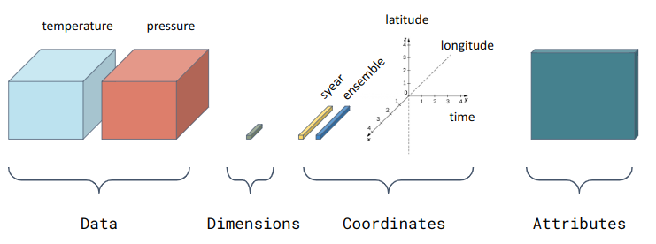

</a>
</a>
</a>

<br>
<br>
<br>

# Tutorial to use clim4health_load function

**clim4health_load** allows the user to load data from a local file in either *.csv* or *.nc* (netcdf file) format. The data will be loaded in the R session as an *s2dv_cube* object which can be input in other **clim4health** functions. *s2dv_cube* objects are discussed in more detail [later in this tutorial](https://earth.bsc.es/gitlab/ghr/harmonize-clim4health/-/edit/hackathon-jan2025/tutorials/clim4health_load.Rmd#L65).

The general process to follow when using the **clim4health** package is:
<br>


## Objectives of this tutorial
- To show how to load a forecast with its corresponding hindcast and reference reanalysis in a format that allows for the application of other **clim4health** functions
- To show how to load data from a csv file in a format that allows for the application of other **clim4health** functions (e.g. **clim4health_postprocess** to obtain downscaled forecasts to point locations)

## Working directory and library dependencies
First obtain current path, which needs to be the path where the **clim4health** repository is cloned, and source the **clim4health_load** function

```r
clim4health_path <- getwd()
source(paste0(clim4health_path, '/functions/clim4health_load.R'))
```

When the function is loaded, the dependencies will also be loaded - if some error occurs, make sure that all the necessary dependencies are installed:

```R
install.packages("startR")
library(startR)

install.packages("lubridate")
library(lubridate)

install.packages("easyNCDF")
library(easyNCDF)

install.packages("CSTools")
library(CSTools)
```

## Climate data
This tutorial uses several different types of climate data.
- **Observations** of climate data are directly observed meteorological variables that come from a variety of sources, including satellites, radar, meteorological stations, aircraft, buoys, and more. Some of these formats are records of climate data in only one location (e.g. weather station data). An example of observational data can be found  and the diagram below illustrates a global system of observations.

    {width=50%}

- **Reanalyses** are another form of "observed" climate data. Reanalysis datasets are created by running a climate model that is combined with observational data that comes from some of the sources above. The benefit of reanalysis data is that it is a physically-consistent, temporally and spatially gridded dataset of past climate, which can be useful if direct observational coverage is sparse. It can also be useful because we can obtain estimates of variables that were not directly observed.

{width=50%}{width=50%}

- **Climate predictions** are model-based projections of *future* climate. This future can be 1 week, 1 month, 1 year, or 10 years away depending on the question being asked. Typically climate predictions are created using some initial condition (based on the current state of the weather/climate/ocean) and, if they are long term, can be forced by long-term projections of future greenhouse gases and aerosol concentrations.
    - Climate predictions are often run with multiple **ensemble members**, which are the same experiment run multiple times starting from slightly different initial conditions. The figure below illustrates how multiple ensemble members can result in different predictions.
    - A **forecast** is one type of prediction which can predict weather on timescales of days/weeks and climate on scales of months/years. This tutorial will use **seasonal forecasts**, which predict climate for the upcoming months.
    - It is possible to use an initial condition from the past to generate a prediction of past climate, called a **hindcast**.


## s2dv cubes

Climate data is often multi-dimensional which means it is sometimes hard to access/manipulate/visualise. **clim4health_load** loads climate data from a netCDF or csv file into R in the form of an *s2dv_cube*.

An *s2dv_cube* is an object in the form of a multidimensional array, containing one or more variables in the dimensions of latitude, longitude and time, and the possibility of more dimensions (like ensemble member and/or forecast leadtime). In addition to the array structure, the object includes attributes or information about its metadata, like the values of its coordinates or the name of the original files.

An *s2dv_cube* is a list of the loaded data itself, its dimensions, its coordinates, and its attributes (metadata). For an *s2dv_cube* called ```data```, these can be accessed with:

- ```data$data``` : an n-dimensional array with named dimensions that contains the loaded data (e.g. temperature);
- ```data$dims``` : a named vector with the names of data dimensions and their lengths. For example, if you load daily data for the year of 2025, we would expect ```data$dims[["time"]] = 365```;
- ```data$coords```: a named list with the coordinates of the data, plus additional attributes of the coordinates. For example, ```data$coords$latitude``` would show the latitudes on which the data is stored, as well as perhaps ```units = "degrees_north"```;
- ```data$attrs```: a named list corresponding to attributes of the object. These include ```$Variable``` (a named list with the variable name in element ```$varName```, and metadata in ```$metadata```), ```$Dates``` (an array of dates of the data), and possibly further metadata.



## Load forecast
Load forecast data from sample data in **clim4health**. It is possible to select a different path to load a forecast from a different file.
Input parameters for **clim4health_load** are *path*, *var*, *sdates*, *data_type* and *ext*.
- *path* is a common string to the folder containing the files to be loaded
- *var* is the name of the variable to be extracted from the files
- *sdates* is a list or vector of strings identifying which start dates to load
- *data_type* should specify if the data is a forecast or observational dataset
- *ext* = 'nc' or 'csv' specifies the file extension.
```r
fcst_path <- paste0(clim4health_path, '/sample_data/ecmwf51/forecast/')
fcst <- clim4health_load(fcst_path, var = "t2m", data_type = "fcst",
                         sdates = "20240401", ext = 'nc')
```

### Check loaded forecast
Check what has been loaded in the object *fcst*

```r
class(fcst)
#[1] "s2dv_cube"

dim(fcst$data)
#  dataset       var      time  ensemble  latitude longitude 
#        1         1         3        51        57        77 

summary(fcst$data)
#   Min. 1st Qu.  Median    Mean 3rd Qu.    Max.
#  269.0   296.0   298.6   297.7   300.2   305.4

print(fcst$attrs$Variable$metadata$t2m$units)
#[1] "K"
```

The object *fcst* is an *s2dv_cube* with the above dimensions in **data**. *ensemble* is each of the ensemble members of forecast model.

Note that the data is in units of Kelvin. In case we want to transform to degree C, we can do it now. We can also change the attributes of the *s2dv_cube* to record this change.
```r
fcst$data <- fcst$data - 273.15
fcst$attrs$Variable$metadata$t2m$units <- "C"
```

We can check the spatial and temporal coordinates of the *s2dv_cube*, which are read from the netcdf file when the data is loaded.

If the data is a forecast, we can find the lead times and start date of the forecast in the metadata.

```r
print(fcst$attrs$Dates)
# [1] "2024-04-01 UTC" "2024-05-01 UTC" "2024-06-01 UTC"

print(dim(fcst$attrs$Dates))
#    sdate lead_time
#        1         3

##### to print the forecast start date #####
print(fcst$attrs$Dates[ , 1])
# [1] "2024-04-01 UTC"
##### or #####
print(fcst$attrs$sdate$vals)
# [1] "2024-04-01 UTC"
############################################

fcst$coords$latitude[1:length(fcst$coords$latitude)]
#  [1]  33  32  31  30  29  28  27  26  25  24  23  22  21  20  19  18  17  16  15
# [20]  14  13  12  11  10   9   8   7   6   5   4   3   2   1   0  -1  -2  -3  -4
# [39]  -5  -6  -7  -8  -9 -10 -11 -12 -13 -14 -15 -16 -17 -18 -19 -20 -21 -22 -23

fcst$coords$longitude[1:length(fcst$coords$longitude)]
#  [1] -93 -92 -91 -90 -89 -88 -87 -86 -85 -84 -83 -82 -81 -80 -79 -78 -77 -76 -75
# [20] -74 -73 -72 -71 -70 -69 -68 -67 -66 -65 -64 -63 -62 -61 -60 -59 -58 -57 -56
# [39] -55 -54 -53 -52 -51 -50 -49 -48 -47 -46 -45 -44 -43 -42 -41 -40 -39 -38 -37
# [58] -36 -35 -34 -33 -32 -31 -30 -29 -28 -27 -26 -25 -24 -23 -22 -21 -20 -19 -18
# [77] -17
```

We could also run the command ```fcst$coords$latitude``` which will show more information about the latitude in addition to the values, as explained [above](https://earth.bsc.es/gitlab/ghr/harmonize-clim4health/-/edit/hackathon-jan2025/tutorials/clim4health_load.Rmd#L73).

### Visualize loaded forecast

Using the function **PlotEquiMap** from the **s2dv** package, we can plot the spatial array. First, we reduce the rest of dimensions (because the coordinates ```dataset```, ```var``` are only of length 1 we want to ```drop``` them). Then in this case we will select the first time and plot the ensemble mean.
```r
time_idx = 1
PlotEquiMap(var = MeanDims(drop(fcst$data)[time_idx,,,], 'ensemble'),
            lat = fcst$coords$latitude,
            lon = fcst$coords$longitude,
            filled.continents = FALSE,
            units = 'Temperature (C)', # text to appear in the legend
            toptitle = paste0('Forecast ', as.Date(fcst$attrs$Dates[time_idx]), ' (ensemble mean)'), # text to appear as overall title
            fileout = paste0(clim4health_path, '/tutorials/figures/clim4health_load/fcst.png')
            )
```


## Load hindcast
We can now load hindcast (past forecast) dataset (from netcdf or csv) from sample data. Typically, you will need to load hindcasts from multiple years to *calibrate* the forecast. In this case we will load the hindcast issued in the same month as the forecast (in this example April) but for each year in the past (in this case 2010, 2011 and 2012). We choose an example file within the folder as our hindcast path. We use the parameter *sdates* to specify the files to load.

```r
sdates <- c()
hcst_path <- c(paste0(clim4health_path, '/sample_data/ecmwf51/hindcast/'))
for (yy in c(2010, 2011, 2012)){
    sdates <- c(sdates, paste0(yy, '0401'))
}

hcst <- clim4health_load(hcst_path, var = "t2m", data_type = "hcst",
                         sdates = sdates, ext = 'nc')
```

### Check loaded hindcast
Check what has been loaded in the object *hcst*

```r
class(hcst)
#[1] "s2dv_cube"

dim(hcst$data)
#  dataset       var      time  ensemble  latitude longitude 
#        1         1         9        25        57        77 

summary(hcst$data)
#   Min. 1st Qu.  Median    Mean 3rd Qu.    Max.
#  266.5   295.4   297.9   297.0   299.4   304.7

hcst$data <- hcst$data - 273.15
hcst$attrs$Variable$metadata$t2m$units <- "C"

```
Check the temporal coordinates of the hcst *s2dv_cube*.

```r
print(hcst$attrs$Dates)
# [1] "2010-04-01 UTC" "2011-04-01 UTC" "2012-04-01 UTC" "2010-05-01 UTC"
# [5] "2011-05-01 UTC" "2012-05-01 UTC" "2010-06-01 UTC" "2011-06-01 UTC"
# [9] "2012-06-01 UTC"

print(dim(hcst$attrs$Dates)) 
#     sdate lead_time
#         3         3

##### to get the hindcast start dates #####
print(hcst$attrs$Dates[ , 1])
# [1] "2010-04-01 UTC" "2011-04-01 UTC" "2012-04-01 UTC"

print(hcst$attrs$sdate$vals)
# [1] "2010-04-01 UTC" "2011-04-01 UTC" "2012-04-01 UTC"
###########################################

```
As we have loaded 3 start dates, each with 3 lead times, there are now 3x3 dates in the file. As with the forecast data, we can access the dates and start dates from the ```$attrs``` element of the *s2dv_cube*.

## Load reference
##### from *.nc*

We would now like to load an observational (reference) dataset. To load the same dates as in the hindcast, we can extract the dates using the ```hcst$coords$time``` object as above. We can also subset by latitude and longitude using *lat_selection* and *lon_selection* parameters.

```r
# extract lat/lon range from hcst object
latitudes <- hcst$coords$latitude
longitudes <- hcst$coords$longitude
lats <- c(min(latitudes), max(latitudes))
lons <- c(min(longitudes), max(longitudes))

# extract dates from hcst object. We are careful here to transpose the dates so that they are ordered correctly.
dates <- as.Date(hcst$attrs$Dates)
dates <- t(drop(dates)[,c(1,2)])
dim(dates) <- NULL
sdates <- format(dates, "%Y%m")

print(sdates)
# [1] "201004" "201005" "201104" "201105" "201204" "201205"

obs_path <- paste0(clim4health_path, '/sample_data/era5land/')
obs <- clim4health_load(obs_path, var = "t2m", ext = "nc",
                        sdates = sdates, data_type = "obs",
                        lat_selection = lats, lon_selection = lons)

```

### Check loaded reference
Check what has been loaded in the object *obs*

```r
class(obs)
#[1] "s2dv_cube"

dim(obs$data)
#  dataset       var      time  ensemble  latitude longitude 
#        1         1         6         1       561       761 

summary(obs$data)
#   Min. 1st Qu.  Median    Mean 3rd Qu.    Max.    NA's 
#  265.9   296.2   297.9   296.5   298.8   305.6 1824240

obs$data <- obs$data - 273.15
obs$attrs$Variable$metadata$t2m$units <- "C"

obs$attrs$Dates
# [1] "2010-04-01 UTC" "2010-05-01 UTC" "2011-04-01 UTC" "2011-05-01 UTC"
# [5] "2012-04-01 UTC" "2012-05-01 UTC"

obs$attrs$sdate
# NULL
```
Our forecast, hindcast, and observational datasets have all been loaded in the same format.

##### from *.csv*

We can also load data in csv format. For example, try:

```r
point_locs <- clim4health_load(paste0(clim4health_path, "/sample_data/point_locations/weather_stations"),
                               data_type = "obs", ext = "csv")

dim(point_locs$data)
#  dataset       var      time  ensemble  latitude longitude
#        1         1       731         1         2         2

summary(point_locs$data)
#   Min. 1st Qu.  Median    Mean 3rd Qu.    Max.    NA's 
#  20.00   21.30   22.50   22.51   23.80   25.00    1462 
```


##### harmonize reference with hindcast
