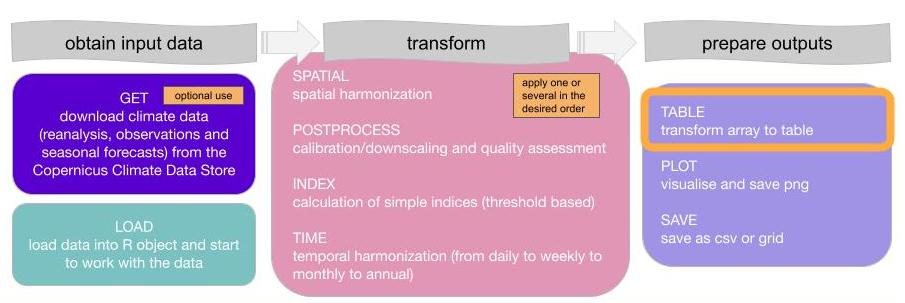

</a>
</a>

<br>
<br>

</a>

<br>
<br>
<br>


# Tutorial to use clim4health_spatial function 

The *clim4health* package provides tools for working with climate data in the form of s2dv_cube objects.

The general workflow for the *clim4health* package is illustrated below:
<br>




**clim4health_spatial** uses **clim4health_load** to load data from an *s2dv_cube* object 
and spatially harmonize it with a shapefile. 

An *s2dv_cube* is a multidimensional array object designed for climate data analysis.
It organizes one or more variables along key dimensions, such as latitude, longitude,
 and time, with additional dimensions often included, such as ensemble members or
  lead time. Beyond the array structure, the s2dv_cube also stores metadata attributes,
   such as coordinate values or the names of the original data files. The structure 
   of an *s2dv_cube* is illustrated below. 


**clim4health_spatial** extracts data from a multidimensional array into
spatial polygons provided by the user........


## Example: Using **clim4health_spatial**


### Load necessary **clim4health** functions and dependencies

First obtain current path, which needs to be the path where the clim4health repository is cloned. 
Next, source the **clim4health_load** function which will load climate data into 
an *s2dv_cube* format, and then use the **clim4health_spatial** function to
aggregate from gridded climate data to spatial polygons.

```R
# Obtain the current working directory
clim4health_path <- getwd()

# Source the required functions to load and transform data.
source(paste0(clim4health_path, '/functions/clim4health_load.R'))
source(paste0(clim4health_path, '/functions/clim4health_spatial.R'))
```

### Load example climate dataset in *s2dv_cube* format

The **clim4health_load** function loads a NetCDF file into an *s2dv_cube* object.

Here's an example with two sample datasets:

```r
obs_path <- paste0(clim4health_path, "/sample_data/era5land/")

obs <- clim4health_load(obs_path, var = "t2m", data_type = "obs",
                         sdates = c("201004", "201005"), ext = 'nc')


fcst_path <- paste0(clim4health_path, "/sample_data/ecmwf51/forecast/")

fcst <- clim4health_load(fcst_path, var = "t2m", data_type = "fcst",
                         sdates = c("20240401", "20240501"), ext = 'nc')
```

The observational data set contains temperature data for 2 months ( "2010-04-01" "2010-05-01" ), 
1 ensemble member (as it is observational data), 561 latitude and 761 longitude points.

Next load an example shapefile.

```r
shp_file <- paste0(clim4health_path, "/sample_data/shapefiles/MGN_ANM_MPIOS.shp")

```

### Spatially aggregate the data using **clim4health_spatial**

```r

result_obs  <- clim4health_spatial(obs,  shp_file)
result_fcst <- clim4health_spatial(fcst, shp_file)

dim(result_obs)
#  dataset      var     time ensemble   region
#        1        1        2        1     1122

result_fcst <- clim4health_spatial(fcst, shp_file)

dim(result_fcst)
#  dataset      var     time ensemble   region 
#        1        1        6       51     1122 

```
