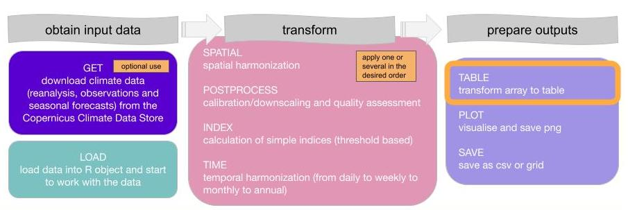
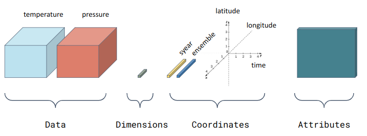

</a>
</a>

<br>
<br>

</a>

<br>
<br>
<br>


# Tutorial to use clim4health_table function 

The *clim4health* package provides tools for working with climate data in the form of s2dv_cube objects.

The general workflow for the *clim4health* package is illustrated below:
<br>




*clim4health_table* allows the user to load data from an *s2dv_cube* object 
and output the data into a tidy dataframe. 

An *s2dv_cube* is a multidimensional array object designed for climate data analysis.
It organizes one or more variables along key dimensions, such as latitude, longitude,
 and time, with additional dimensions often included, such as ensemble members or
  lead time. Beyond the array structure, the s2dv_cube also stores metadata attributes,
   such as coordinate values or the names of the original data files. The structure 
   of an *s2dv_cube* is illustrated below. 




*clim4health_table* transforms data from a multidimensional array into a tidy data frame.
 In this format, each row corresponds to a single data point, with columns representing
  the various dimensions (e.g., time, ensemble, latitude, longitude, etc.).


## Example: Using *clim4health_table*


### Load necessary *clim4health* functions and dependencies

First obtain current path, which needs to be the path where the clim4health repository is cloned. 
Next, source the *clim4health_load* function which will load climate data into 
an *s2dv_cube* format, and the the *clim4health_table* function to transform the 
*s2dv_cube* into a dataframe.

```R
# Obtain the current working directory 
clim4health_path <- getwd()

# Source the required functions to load and transform data.
source(paste0(clim4health_path, '/functions/clim4health_load.R'))   
source(paste0(clim4health_path, '/functions/clim4health_table.R'))   
```


When the function is loaded, the dependencies will also be loaded. 
If some error occurs, make sure that all the necessary dependencies are installed:

```R

# Install and load required packages.
install.packages("startR")
library(startR)

install.packages("lubridate")
library(lubridate)

install.packages("easyNCDF")
library(easyNCDF)

install.packages("CSTools")
library(CSTools)
```

### Load example climate dataset in *s2dv_cube* format

The *clim4health_load* function loads a NetCDF file into an *s2dv_cube* object.

Here’s an example with a sample dataset:

```R

fcst_path <- paste0(clim4health_path, '/sample_data/ecmwf51/forecast/')

fcst <- clim4health_load(fcst_path, var = "t2m", data_type = "fcst",
                         sdates = "20240401", ext = 'nc')
     

```

This data set contains temperature data for 3 months ( "2024-04-01" "2024-05-01" "2024-06-01"), 
51 ensembles, 57 latitude and 77 longitude points. Time information is divided
into year, month, day and time_of_day dimensions.  

Inspect the *s2dv_cube* object

```R

# Check the class of the object.
class(fcst)
#[1] "s2dv_cube"

# Inspect the dimensions of the data array.
 dim(fcst$data)

# dataset         var        year       month         day time_of_day 
#      1           1           1           3           1           1 

# ensemble  latitude longitude
#      51        57        77
```

Inspect the elements of each dimension in the *s2dv_cube* object. 
Each dimension will become a column in the tidy dataframe, with a row for each 
coordinate.

```R
# Check the variable coordinates.
fcst$coords$var
# [1] "t2m"

# Check the year coordinates.
fcst$coords$year
# [1] 2024

# Check the month coordinates.
fcst$coords$month
# [1] 4 5 6

# Check the day coordinates.
fcst$coords$day
# [1] 1

# Check the time_of_day coordinates.
fcst$coords$time_of_day
# [1] "00:00"

# Check the ensemble coordinates.
fcst$coords$ensemble
#  [1]  1  2  3  4  5  6  7  8  9 10 11 12 13 14 15 16 17 18 19 20 21 22 23 24 25
# [26] 26 27 28 29 30 31 32 33 34 35 36 37 38 39 40 41 42 43 44 45 46 47 48 49 50
# [51] 51

# Check the latitude coordinates.
fcst$coords$latitude[1:length(fcst$coords$latitude)]
# [1]  33  32  31  30  29  28  27  26  25  24  23  22  21  20  19  18  17  16  15
# [20]  14  13  12  11  10   9   8   7   6   5   4   3   2   1   0  -1  -2  -3  -4
# [39]  -5  -6  -7  -8  -9 -10 -11 -12 -13 -14 -15 -16 -17 -18 -19 -20 -21 -22 -23

# Check the longitude coordinates.
fcst$coords$longitude[1:length(fcst$coords$longitude)]
# [1] -93 -92 -91 -90 -89 -88 -87 -86 -85 -84 -83 -82 -81 -80 -79 -78 -77 -76 -75
# [20] -74 -73 -72 -71 -70 -69 -68 -67 -66 -65 -64 -63 -62 -61 -60 -59 -58 -57 -56
# [39] -55 -54 -53 -52 -51 -50 -49 -48 -47 -46 -45 -44 -43 -42 -41 -40 -39 -38 -37
# [58] -36 -35 -34 -33 -32 -31 -30 -29 -28 -27 -26 -25 -24 -23 -22 -21 -20 -19 -18
# [77] -17

```

### Convert the *s2dv_cube* object into a tidy data frame using *clim4health_table*

```R

# Transform the s2dv_cube into a tidy dataframe using clim4health_table.
formatted.table <- clim4health_table(fcst)

# Display the first few rows of the tidy dataframe.
knitr::kable(head(formatted.table), format = "markdown")
```


|dataset |var |time       |ensemble |latitude |longitude | values|
|:-------|:---|:----------|:--------|:--------|:---------|------:|
|dat1    |t2m |2024-04-01 |1        |33       |-93       | 291.61|
|dat1    |t2m |2024-05-01 |1        |33       |-93       | 298.08|
|dat1    |t2m |2024-06-01 |1        |33       |-93       | 301.45|
|dat1    |t2m |2024-04-01 |2        |33       |-93       | 292.39|
|dat1    |t2m |2024-05-01 |2        |33       |-93       | 296.74|
|dat1    |t2m |2024-06-01 |2        |33       |-93       | 299.25|


Inspect the output tidy dataframe

```R

# Check the class of the dataframe.
class(formatted.table)
# [1] "data.frame"

# View the structure of the dataframe.
str(formatted.table)

#'data.frame':   671517 obs. of  7 variables:
# $ dataset    : Factor w/ 1 level "dat1": 1 1 1 1 1 1 1 1 1 1 ...
# $ var        : Factor w/ 1 level "t2m": 1 1 1 1 1 1 1 1 1 1 ...
# $ year       : Factor w/ 1 level "2024": 1 1 1 1 1 1 1 1 1 1 ...
# $ month      : Factor w/ 3 levels "4","5","6": 1 2 3 1 2 3 1 2 3 1 ...
# $ day        : Factor w/ 1 level "1": 1 1 1 1 1 1 1 1 1 1 ...
# $ time_of_day: Factor w/ 1 level "00:00": 1 1 1 1 1 1 1 1 1 1 ...
# $ ensemble   : Factor w/ 51 levels "1","2","3","4",..: 1 1 1 2 2 2 3 3 3 4 ...
# $ latitude   : Factor w/ 57 levels "33","32","31",..: 1 1 1 1 1 1 1 1 1 1 ...
# $ longitude  : Factor w/ 77 levels "-93","-92","-91",..: 1 1 1 1 1 1 1 1 1 1 ...
# $ values     : num  292 298 301 292 297 ...


```
The factor levels in each column of the dataframe match the coordinates in each 
dimension of the *s2dv_cube* object
