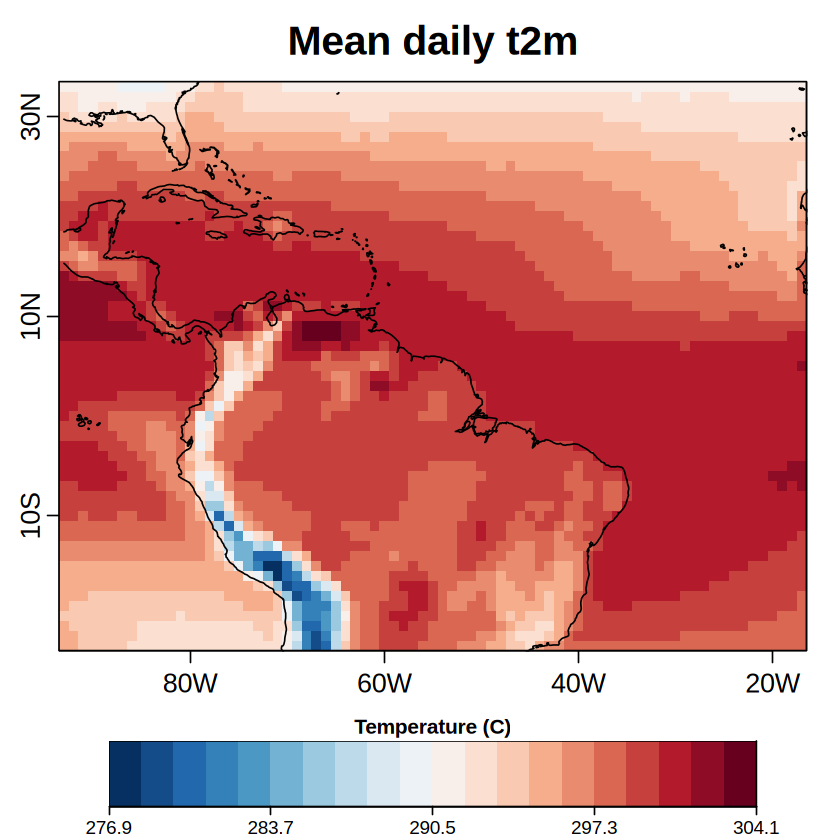
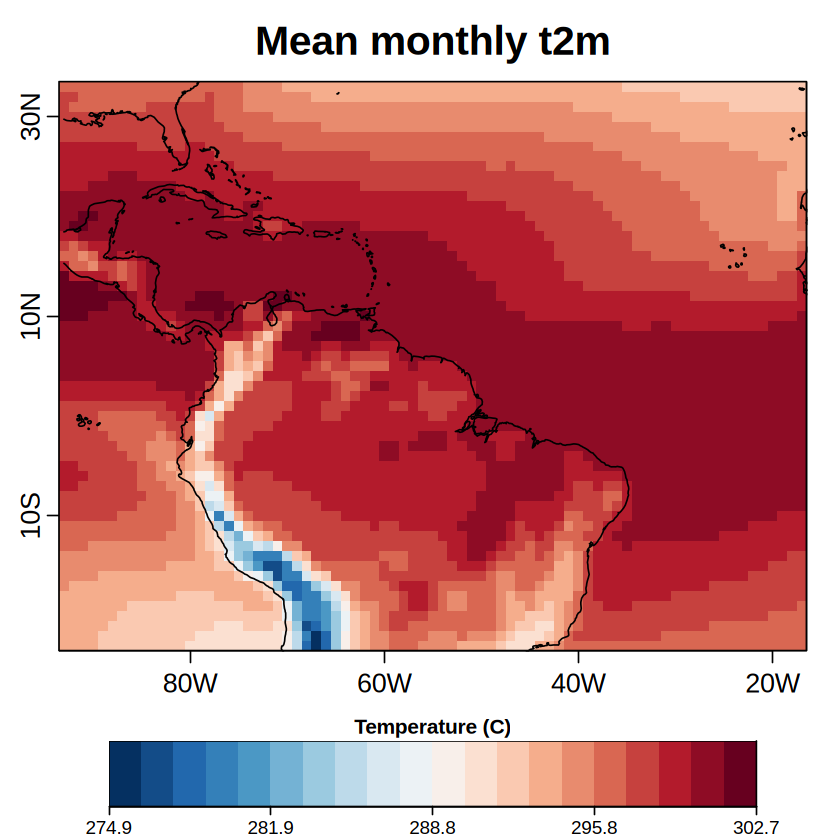
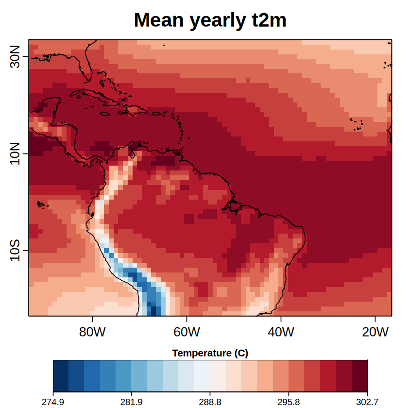

<div style="text-align: center;">
    <div style="display: inline-block;">
        
    </div>
    <div style="display: inline-block;">
        
    </div>
    <br></br>
    <br></br>
    <h1>Tutorial: Using the <code>clim4health_time</code> Function</h1>
    


</div>
<hr style="border: 1px solid #000; width: 80%; margin: 20px auto;">

## 1. Load the functions from clim4health


```R
source('../functions/clim4health_load.R')
source('../functions/clim4health_time.R')

library(lubridate)
library(dplyr)
```

    
    Attaching package: ‘s2dv’
    
    
    The following object is masked from ‘package:base’:
    
        Filter
    
    
    
    Attaching package: ‘lubridate’
    
    
    The following objects are masked from ‘package:base’:
    
        date, intersect, setdiff, union
    
    
    Loading required package: maps
    
    Loading required package: qmap
    
    Loading required package: fitdistrplus
    
    Loading required package: MASS
    
    Loading required package: survival
    
    Loading required package: easyVerification
    
    Loading required package: SpecsVerification
    
    
    Attaching package: ‘SpecsVerification’
    
    
    The following object is masked from ‘package:s2dv’:
    
        Corr
    
    
    
    Attaching package: ‘easyVerification’
    
    
    The following object is masked from ‘package:SpecsVerification’:
    
        EnsCorr
    
    
    
    Attaching package: ‘dplyr’
    
    
    The following object is masked from ‘package:MASS’:
    
        select
    
    
    The following objects are masked from ‘package:stats’:
    
        filter, lag
    
    
    The following objects are masked from ‘package:base’:
    
        intersect, setdiff, setequal, union
    
    
    

-------------------------------------------------------------------------------
## 2. Load the dataset with the function clim4health_load


```R
data_clim <- clim4health_load('../sample_data/ecmwf51/forecast/',var = "t2m", 
                         data_type = "fcst", sdates = "20240401", ext = 'nc')
```

    Warning message:
    “! Warning: Parameter 'merge_across_dims' is changed to FALSE because there is no
    !   *_across argument.”
    Warning message:
    “! Warning: Parameter 'pattern_dims' not specified. Taking the first dimension,
    !   'dataset' as 'pattern_dims'.”
    Warning message:
    “! Warning: Could not find any pattern dim with explicit data set descriptions (in
    !   the form of list of lists). Taking the first pattern dim, 'dataset',
    !   as dimension with pattern specifications.”
    Warning message:
    “! Warning: Found dimension 'latitude' is required to reorder but no 'latitude_var'
    !   provided. "latitude_var = 'latitude'" has been automatically added
    !   to the Start call.”
    Warning message:
    “! Warning: Found dimension 'longitude' is required to reorder but no
    !   'longitude_var' provided. "longitude_var = 'longitude'" has been
    !   automatically added to the Start call.”
    Warning message:
    “! Warning: Not found any dimensions able to be split. The parameter
    !   'split_multiselected_dims' is changed to FALSE.”
    Warning message in start_parameters$synonims["time_of_day"] <- c("time", "lead_time", :
    “number of items to replace is not a multiple of replacement length”
    

    NULL
    

    Warning message:
    “! Warning: Parameter 'pattern_dims' not specified. Taking the first dimension,
    !   'dataset' as 'pattern_dims'.”
    Warning message:
    “! Warning: Could not find any pattern dim with explicit data set descriptions (in
    !   the form of list of lists). Taking the first pattern dim, 'dataset',
    !   as dimension with pattern specifications.”
    * Exploring files... This will take a variable amount of time depending
    *   on the issued request and the performance of the file server...
    
    Warning message:
    “! Warning: Found specified values for dimension 'time_of_day' but no
    !   'time_of_day_var' requested. "time_of_day_var = 'time_of_day'" has
    !   been automatically added to the Start call.”
    Warning message:
    “! Warning: Found dimension 'latitude' is required to reorder but no 'latitude_var'
    !   provided. "latitude_var = 'latitude'" has been automatically added
    !   to the Start call.”
    Warning message:
    “! Warning: Found dimension 'longitude' is required to reorder but no
    !   'longitude_var' provided. "longitude_var = 'longitude'" has been
    !   automatically added to the Start call.”
    * Detected dimension sizes:
    
    *       dataset:  1
    
    *           var:  1
    
    *          year:  1
    
    *         month:  3
    
    *           day:  1
    
    *   time_of_day:  1
    
    *      ensemble: 51
    
    *      latitude: 57
    
    *     longitude: 77
    
    * Total size of requested data:
    
    *   1 x 1 x 1 x 3 x 1 x 1 x 51 x 57 x 77 x 8 bytes = 5.1 Mb
    
    * If the size of the requested data is close to or above the free shared
    *   RAM memory, R may crash.
    
    * If the size of the requested data is close to or above the half of the
    *   free RAM memory, R may crash.
    
    * Will now proceed to read and process 1 data files:
    
    *   ../sample_data/ecmwf51/forecast/t2m_20240401.nc
    
    * Loading... This may take several minutes...
    
    * Successfully retrieved data.
    
    

### Number of dimension for the datetimes
- Dimension Year: 3
- Dimension Month: 4
- Dimension Day: 5
- Dimension Time_of_day: 6

---------------------------------------------------------------------------------
## 3. Daily aggregations
- Perfform daily aggregations
- Plot a map for one day


```R
# Perform Daily Aggregation
daily_data <- clim4health_time(data_clim, aggregation = "daily")
```


```R
PlotEquiMap(var = daily_data$data[1, 1, 1, 1, 1, , ],
            lat = data_clim$coords$latitude,
            lon = data_clim$coords$longitude,
            filled.continents = FALSE,
            units = 'Temperature (C)', # text to appear in the legend
            toptitle = 'Mean daily t2m', # text to appear as overall title
            colNA = '#ffffff'
            )
```


    

    


------------------------------------------------------------------------
## 4. Monthly aggregations
- Perform monthly aggregation
- Plot a map for one day


```R
# Perform Monthly Aggregation
monthly_data <- clim4health_time(data_clim, aggregation = "monthly")
```


```R
PlotEquiMap(var = monthly_data$data[1, 1, 1, 1, , ],
            lat = data_clim$coords$latitude,
            lon = data_clim$coords$longitude,
            filled.continents = FALSE,
            units = 'Temperature (C)', # text to appear in the legend
            toptitle = 'Mean monthly t2m', # text to appear as overall title
            colNA = '#ffffff'
            )
```


    

    


-----------------------------------------------------------------------
## 5. Yearly aggregations
- Perform yearly aggregations
- Plot a map for one year


```R
# Perform Yearly Aggregation
yearly_data <- clim4health_time(data_clim, aggregation = "yearly")
```


```R
PlotEquiMap(var = yearly_data$data[1, 1, 1, , ],
            lat = data_clim$coords$latitude,
            lon = data_clim$coords$longitude,
            filled.continents = FALSE,
            units = 'Temperature (C)', # text to appear in the legend
            toptitle = 'Mean yearly t2m', # text to appear as overall title
            colNA = '#ffffff'
            )
```


    

    

